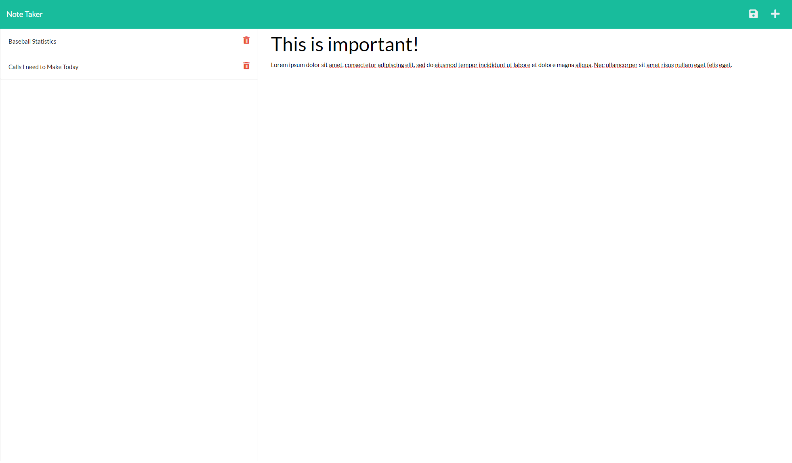

# note_taker #

**Note:** This repository contains my source code for a Note Taker using NodeJS and ExpressJS as part of Challenge 11 of GA Tech's 2022 Coding Bootcamp.

## Description ##

Many people use notes to organize their daily lives. Whether it's on paper or on their computers and other device note taking is essential. Wouldn't it be great if there
were a note taking application you could access anywhere? Well look no further! 

In this note taker application you can quickly and easily create new notes by providing a
title and text before clicking on the save icon that will appear at the top right! Saved notes will appear in the list on the left-hand side so that you can easily look over any
notes you wish.

## Live Website ##

https://devin-note-taker.herokuapp.com/

## Screenshot ##

